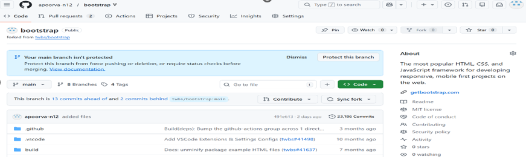
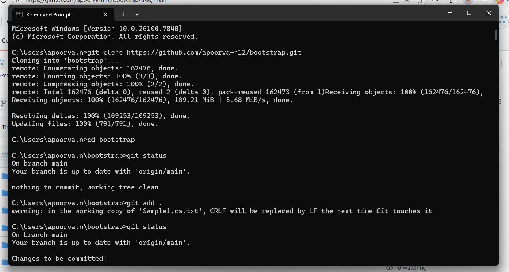
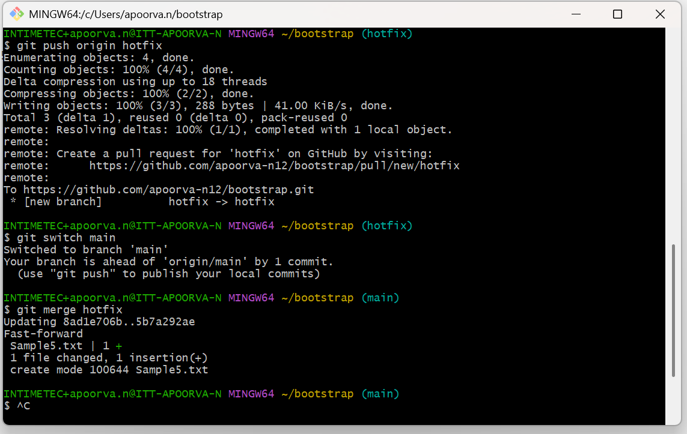
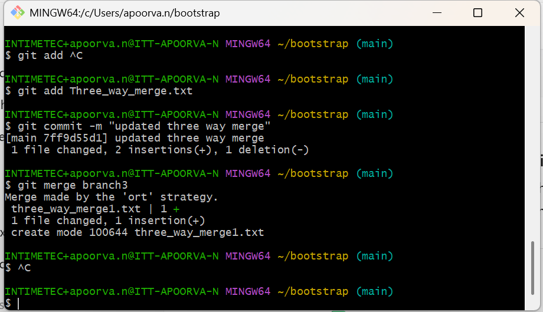
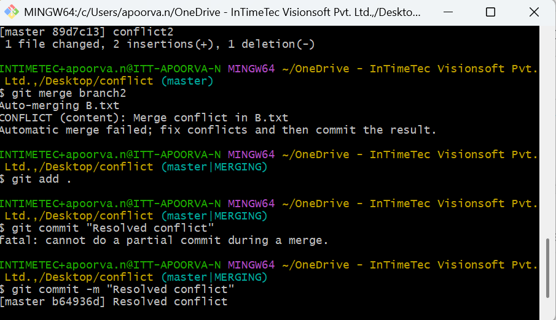
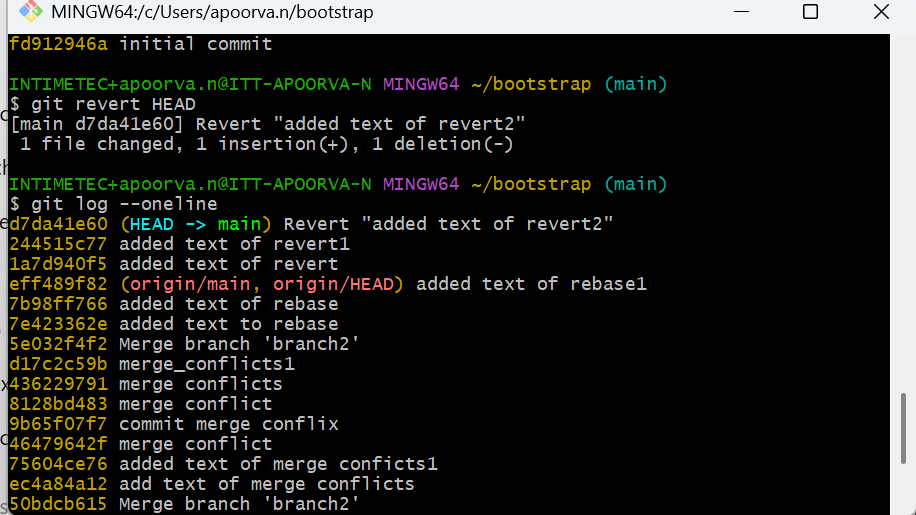
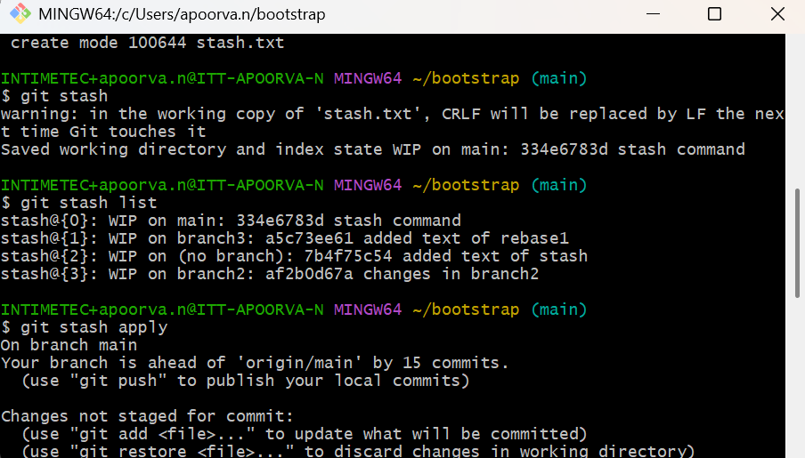
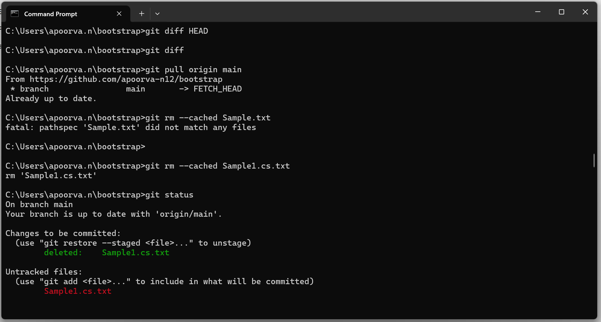
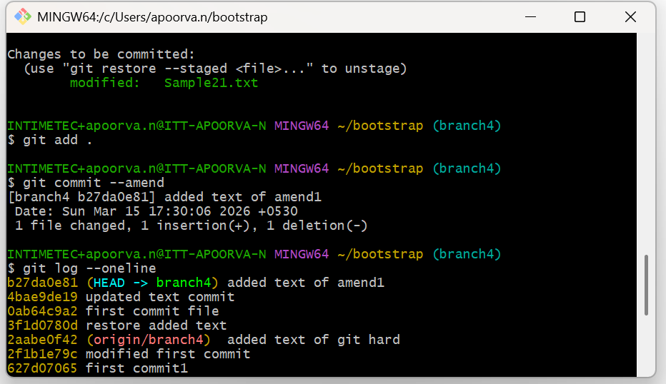

## Git Assessment Practice

This document provides an overview of the Git commands practiced during the assignment, supported by screenshots.

---

### 1. Fork : Fork is a copy of someone else’s repository that lives under your own account
**Screenshot:** 

### 2. Git Clone : git clone is a command used to download a repository from a remote server
**Screenshot:** 

### 3. Directory : A directory is a folder in a computer that is used to store and organize files and other folders.
**Screenshot:** 

### 4. Git Add : Stage all changed files.
**Screenshot:** 

### 5. Git Commit : It records changes to tracked files.
**Screenshot:** 

### 6. Git Push : Push a tag to the remote.
**Screenshot:** 

### 7. Git Pull : used to fetch the latest changes from the remote repository and merge them into the local branch
**Screenshot:** 

### 8. Git Checkout : integrates changes from another branch into the current branch
**Screenshot:** 

### 9. Fast Forward Merge : Main branch has not changed since you created another branch.
**Screenshot:** 

### 10. Three-way Merge : A three-way merge is a Git merging method where Git uses three commits to combine changes:
**Screenshot:** 

### 11. Git Merge Conflict : A merge conflict happens when Git cannot automatically combine changes from two branches.
**Screenshot:** 

### 12. Resolving Merge Conflict : A resolved merge conflict means you have fixed the conflict manually and Git is now able to complete the merge successfully.
**Screenshot:** 

### 13. Git Rebase : means moving your branch commits on top of another branch to maintain a clean commit history
**Screenshot:** 

### 14. Git Cherry-pick : commit copy between branches (local).
**Screenshot:** 

### 15. Git Log : Shows commits; HEAD is the current commit
**Screenshot:** 

### 16. Git Diff : shows what changes were made in files.
**Screenshot:** 

### 17. Git HEAD : Show the latest commit pointed to by HEAD.
**Screenshot:** 

### 18. Git Restore :  used to restore files to their previous state.
**Screenshot:** 

### 19. Git Reset Soft : Undo commits only, keep all changes staged for a new commit
**Screenshot:** 

### 20. Git Reset Mixed : Undo commits and unstage changes. Changes remain in working directory.
**Screenshot:** 

### 21. Git Reset Hard : Undo commits and delete all changes permanently.
**Screenshot:** 

### 22. Git Revert : It creates a new commit that undoes the changes introduced by a previous commit
**Screenshot:** 

### 23. Git Stash : temporarily save the uncommitted changes.
**Screenshot:** 

### 24. Git Tag : marking a specific commit with a label (tag) so it’s easy to find later.
**Screenshot:** 

### 25. Git rm --cached : git rm -–cached used to remove the document.
**Screenshot:** 

### 26. Git Amend : is used to modify the last commit.
**Screenshot:** 

---

### 27. Git Assessment Document
**File:** [Download](docs/images/git_assessment_document_Apoorva_.docx)

### 28. Git Practice Assessment
**File:** [Download](docs/images/Apoorva_git_assessment_Document_practice.docx)