### **git assessment pratice**

This document provides an overview of the Git commands practiced during the assignment, supported by screenshots.

1.directory
Screenshot: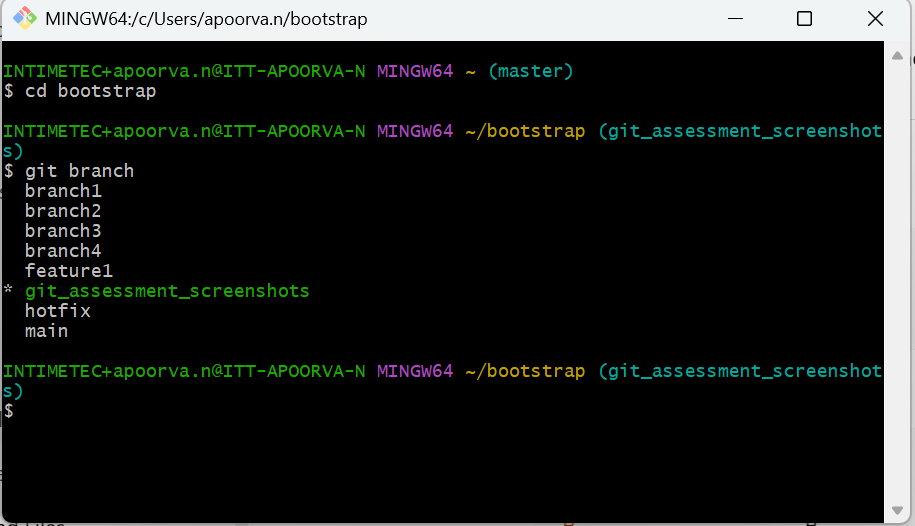

2.fast forward merge
Screenshot:

3.fork 
Screenshot: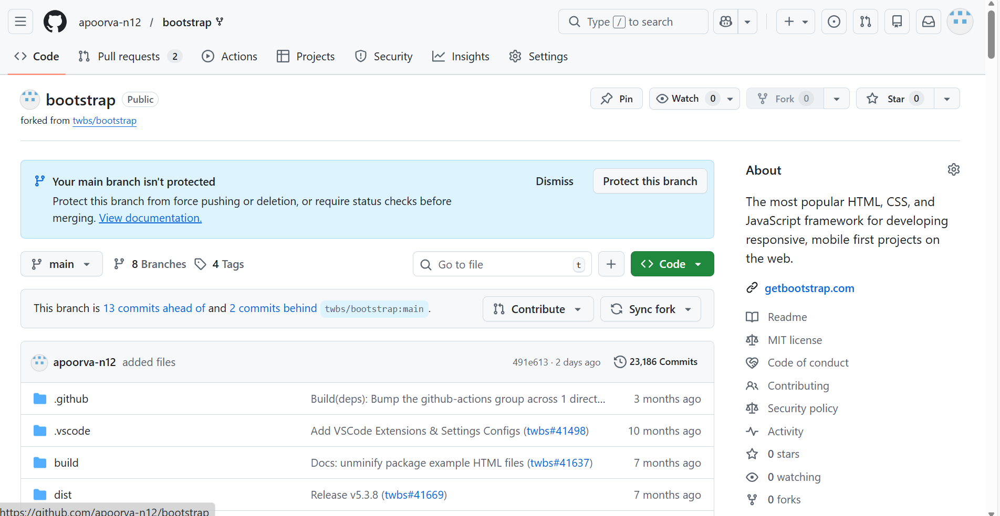

4.git add
Screenshot: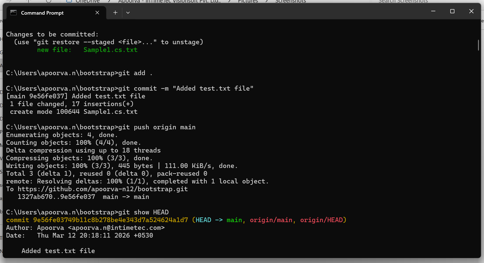

5.git amend
Screenshot:

6.git checkout
Screenshot: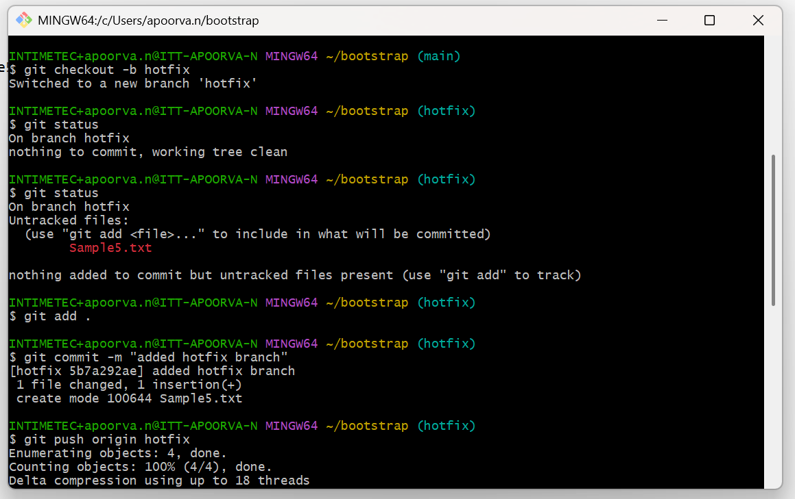

7.git cherry-pick
Screenshot: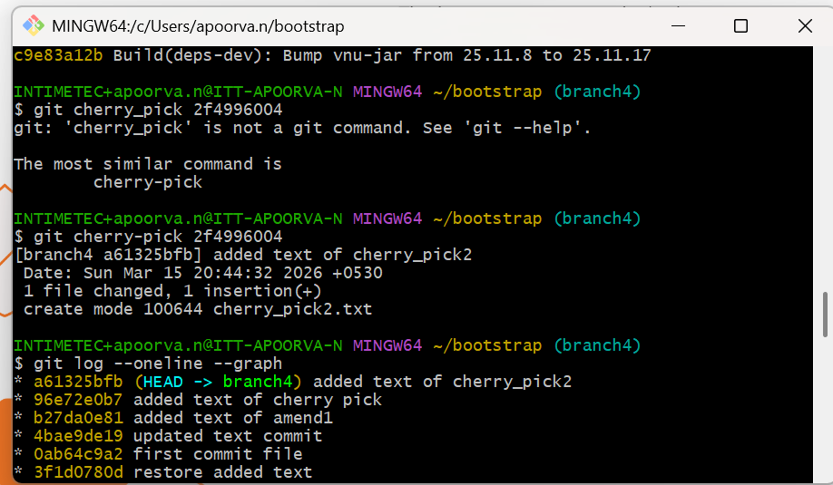

8.git commit
Screenshot: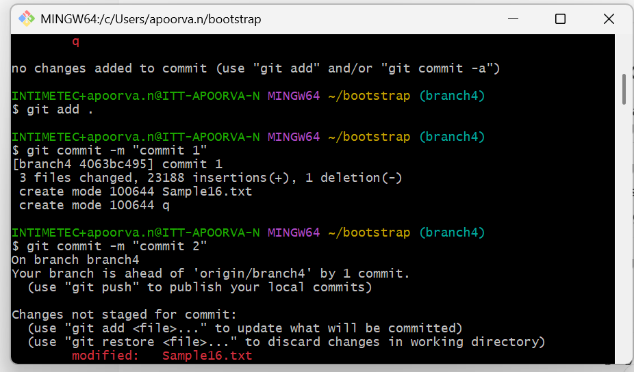

9.git diff
Screenshot: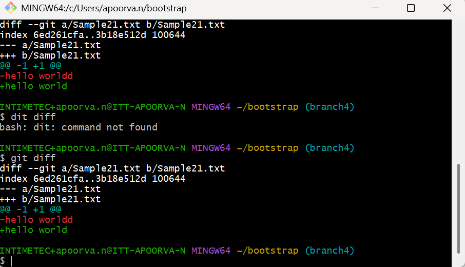

10.git HEAD
Screenshot: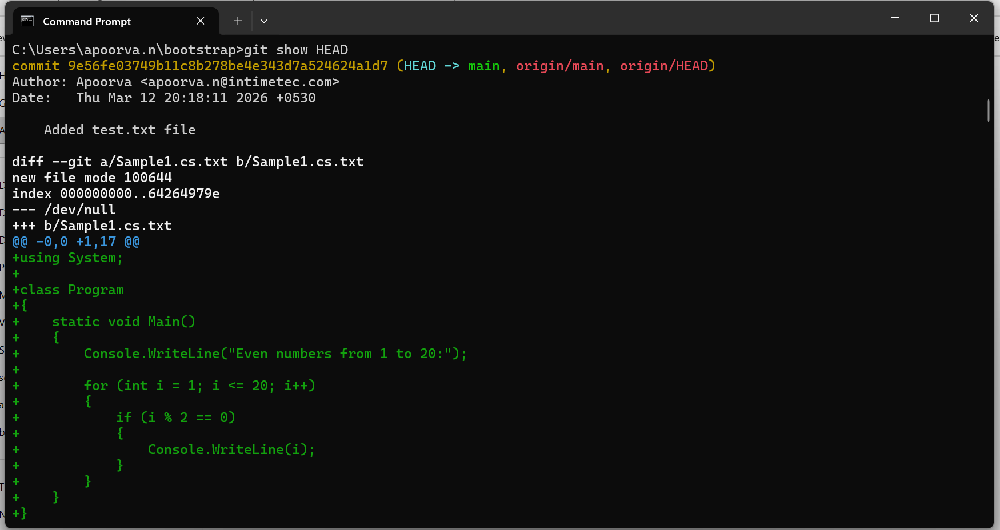

11.git log 
Screenshot: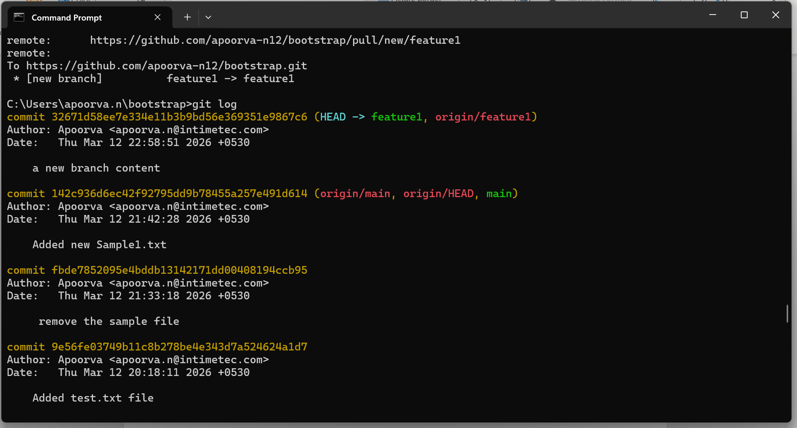

12.git pull
Screenshot: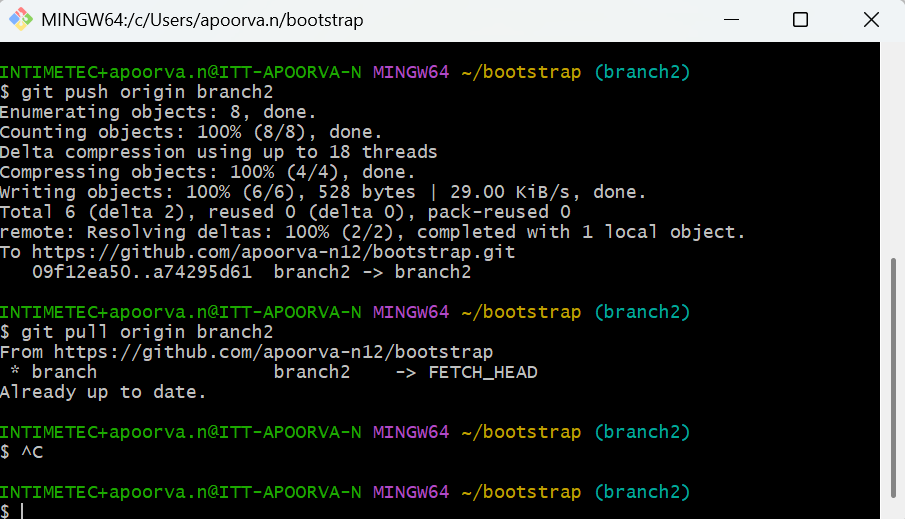

13.git push
Screenshot: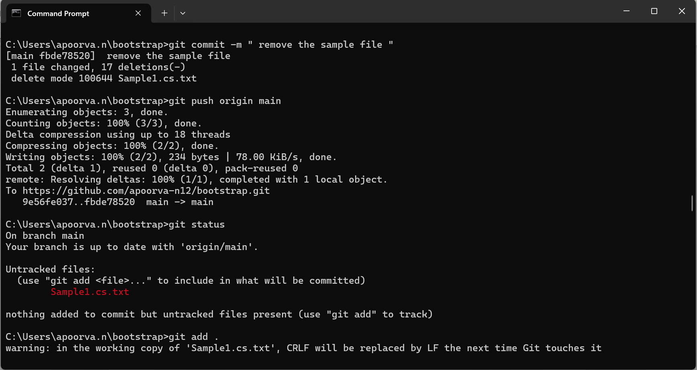

14.git reset hard
Screenshot: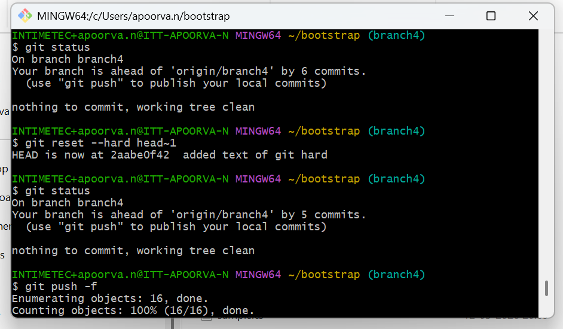

15.git reset mixed
Screenshot: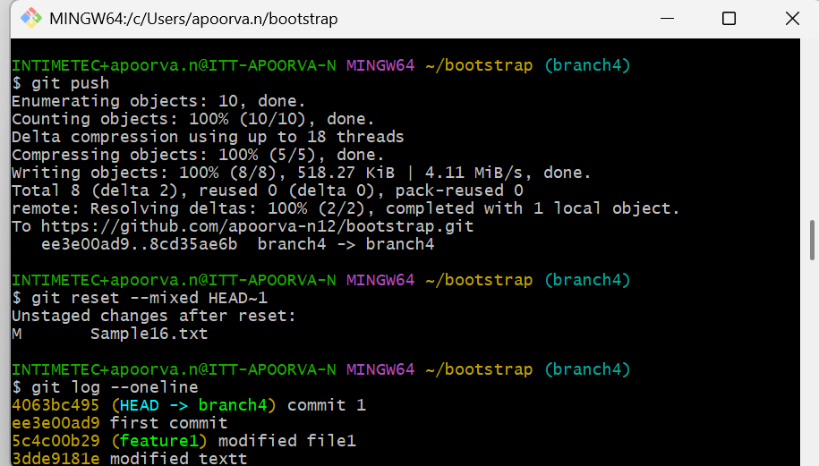

16.git restore
Screenshot: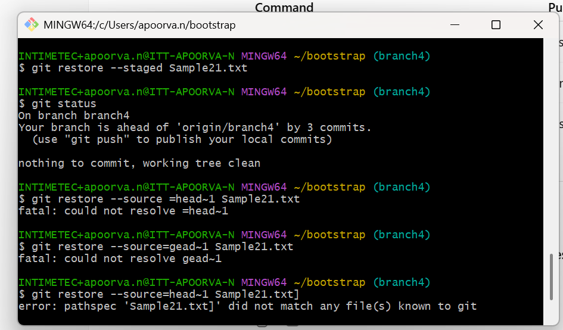

17.git rm --cached
Screenshot:

18.git stash
Screenshot: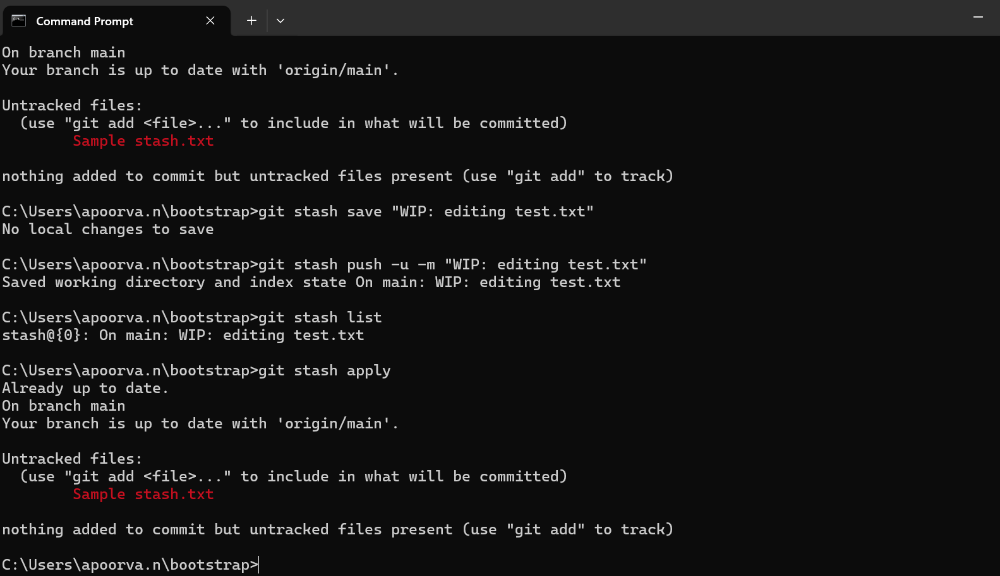

19.git tag
Screenshot: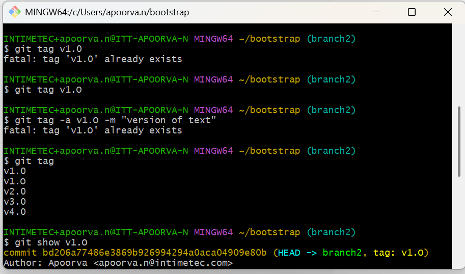

20.git clone_status_add
Screenshot:

21.git merge conflict
Screenshot: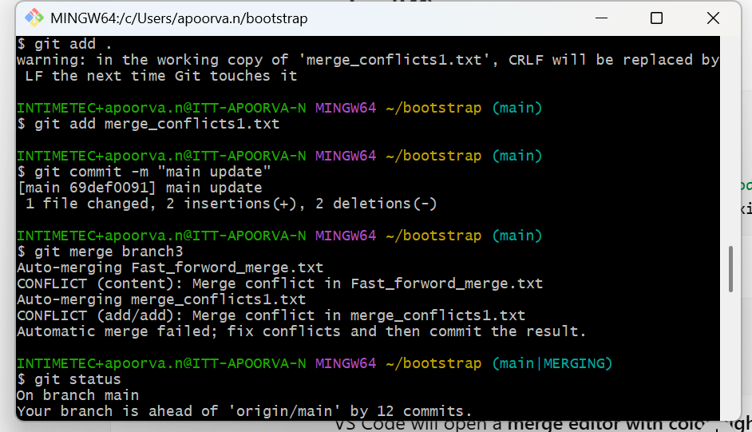

22.git rebase
Screenshot: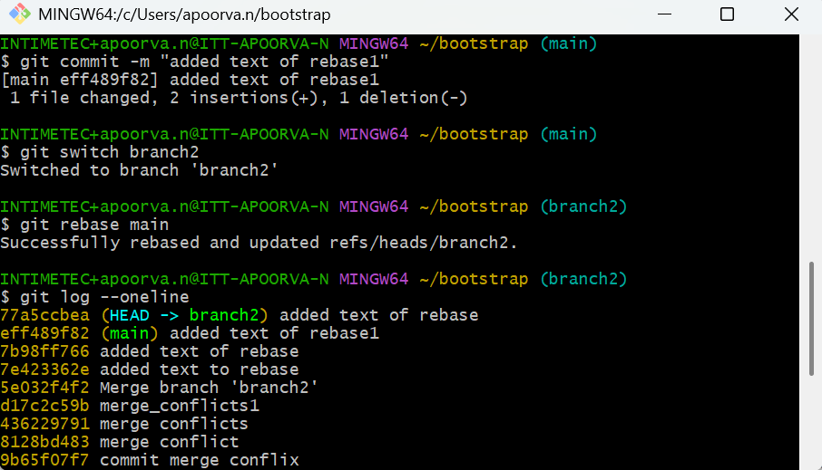

23.git resolving merge conflict
Screenshot: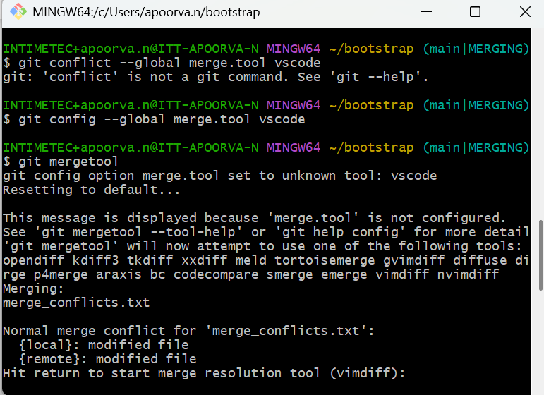
 
24.git revert
Screenshot:

25.git reset soft
Screenshot: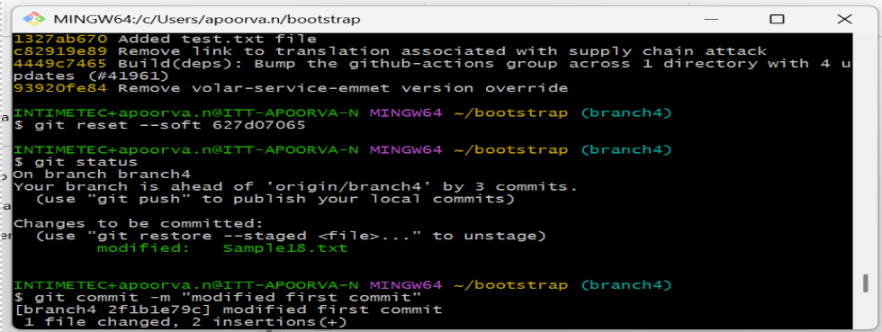

### 26 git_assessment
File:[git_assessment](docs/images/git_assessment_document_Apoorva.docx)

### 27 git_pratice_assessment
File:[git_assessment](docs/images/Apoorva_git_assessment_pratice_Document.docx)

### Week1_manual_testing_assessment

File:[Manual_test_assessment]("Week1_manual_testing_assessment/Manual_test_Week1_assessment.xlsx")

